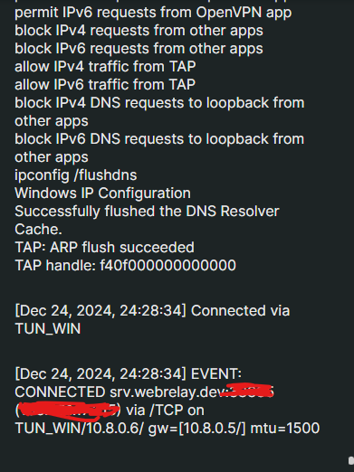
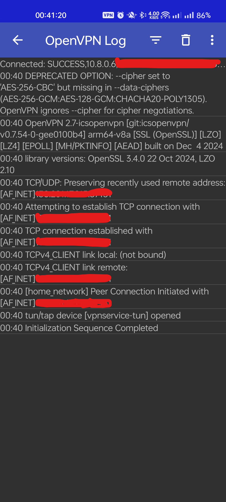

---
date:
    created: 2023-12-22
    updated: 2024-12-23
---

# OpenVPN Behind CGNAT

If you're in a situation where you don't have static IP and you can't port forward to WAN.

- [What is CGNAT](https://en.wikipedia.org/wiki/Carrier-grade_NAT)

## Requirements

- Router with Portforwarding
- Ngrok [Checkout Setup](https://dashboard.ngrok.com/get-started/setup/linux) or [Web Relay](https://docs.webrelay.dev/docs/intro/)

## Using Ngrok

1. [Install Ngrok](https://dashboard.ngrok.com/get-started/setup/linux)
2. Start ngrok on TCP 443

    ```bash
    sudo ngrok tcp 443
    ```

    You would get something like number.tcp.region.ngrok.io:random-port-forward-number

    ```log
    ngrok                         (Ctrl+C to quit)
    Session Status                online
    Account                       XXXYYYYYY (Plan: XXXX)
    Version                       3.19.0
    Region                        Country (country_code)
    Latency                       7ms
    Web Interface                 http://127.0.0.1:4040
    Forwarding                    tcp://x.tcp.xx.ngrok.io:xxxxx -> localhost:443

    Connections                   ttl     opn     rt1     rt5     p50     p90
    ```

    Keep this running and take a note tcp://x.tcp.xx.ngrok.io:xxxxx

- In Free account you get Data Transfer Out of 1GB as of now.

## Using WebRelay (Not Available on Windows)

- Get the webrelay binary.

    ```bash
    curl -LO https://dl.webrelay.dev/linux/x64/webrelay && chmod +x webrelay
    ```

- Login

    ```bash
    webrelay login <your-email-id>
    ```

    An OTP is sent to your mail, Enter that OTP.

    ```bash
    ? Enter the token you received in your email: xxxxxx
    Login successful
    ```

- Start WebRelay on TCP Port

    ```bash
    ./webrelay tcp -p 443
    ```

    ```bash
    ./webrelay tcp -p 443
    Tunnel available at -> srv.webrelay.dev:xxxxx
    ```

- Its [Free](https://docs.webrelay.dev/docs/whatis) only requires email to sign up

## Check/Enable Firewall Settings

- using `ufw`

    ```bash
    sudo ufw allow 443/tcp
    sudo ufw enable
    ```

- If using `iptables`

    ```bash
    sudo iptables -A INPUT -p tcp --dport 443 -j ACCEPT
    ```

- Save the rules

    ```bash
    sudo netfilter-persistent save
    ```

## Install OpenVPN Server on Linux

I'm using Debian 12 & TP-Link Router Archer C6

### Install OpenVPN and Easy-RSA

```bash
sudo apt update && sudo apt upgrade -y
sudo apt install openvpn easy-rsa -y
```

### Setup the Public Key Infrastructure (PKI)

- Create the Easy-RSA Directory

    ```bash
    make-cadir ~/openvpn-ca
    cd ~/openvpn-ca
    ```

- Configure the PKI Variables, Edit the `vars` file:

    ```bash
    vi vars
    ```

    Modify and Add the Following lines.

    ```bash
    set_var EASYRSA_REQ_COUNTRY    "YourCountry"
    set_var EASYRSA_REQ_PROVINCE   "YourProvince"
    set_var EASYRSA_REQ_CITY       "YourCity"
    set_var EASYRSA_REQ_ORG        "YourOrg"
    set_var EASYRSA_REQ_EMAIL      "YourEmail@example.com"
    set_var EASYRSA_REQ_OU         "YourOrgUnit"
    ```

- Initialize the PKI

    ```bash
    ./easyrsa init-pki
    ```

    Output

    ```bash
    abu@ABU-PC:~/openvpn-ca$ ./easyrsa init-pki
    * Notice:

        init-pki complete; you may now create a CA or requests.

        Your newly created PKI dir is:
        * /home/abu/openvpn-ca/pki

    ```

- Build the Certificate Authority (CA)

    ```bash
    ./easyrsa build-ca
    ```

    _Set a password and Remember it_

    ```bash
    abu@ABU-PC:~/openvpn-ca$ ./easyrsa build-ca
    * Notice:
    Using Easy-RSA configuration from: /home/abu/openvpn-ca/vars

    * WARNING:

        Move your vars file to your PKI folder, where it is safe!

    * Notice:
    Using SSL: openssl OpenSSL 3.0.15 3 Sep 2024 (Library: OpenSSL 3.0.15 3 Sep 2024)


    Enter New CA Key Passphrase:
    Re-Enter New CA Key Passphrase:
    Using configuration from /home/abu/openvpn-ca/pki/8273b3c0/temp.058c7933
    ..........+..+...+++++++++++++++++++++++++++++++++++++++++++++++++++++++++++++++++*.....+++++++++++++++++++++++++++++++++++++++++++++++++++++++++++++++++*.....................+...+............+..+.......+........+++++++++++++++++++++++++++++++++++++++++++++++++++++++++++++++++
    ...+.+++++++++++++++++++++++++++++++++++++++++++++++++++++++++++++++++*..+..+...+.......+...+...+.....+.+........+++++++++++++++++++++++++++++++++++++++++++++++++++++++++++++++++*.........+.....+...+....+.....+.+............+...+...........+...+......+.+......+...+.....+....+..+...+.+...........+..................+..........+..+...+.......+.....+.+++++++++++++++++++++++++++++++++++++++++++++++++++++++++++++++++
    Enter PEM pass phrase:
    Verifying - Enter PEM pass phrase:
    -----
    You are about to be asked to enter information that will be incorporated
    into your certificate request.
    What you are about to enter is what is called a Distinguished Name or a DN.
    There are quite a few fields but you can leave some blank
    For some fields there will be a default value,
    If you enter '.', the field will be left blank.
    -----
    Common Name (eg: your user, host, or server name) [Easy-RSA CA]:home_network

    * Notice:

    CA creation complete and you may now import and sign cert requests.
    Your new CA certificate file for publishing is at:
    /home/abu/openvpn-ca/pki/ca.crt
    ```

### Generate Server Certificates and Keys

1. Generate a key Pair for the server

    ```bash
    ./easyrsa gen-req server nopass
    ```

    ```bash
    abu@ABU-PC:~/openvpn-ca$ ./easyrsa gen-req server nopass
    * Notice:
    Using Easy-RSA configuration from: /home/abu/openvpn-ca/vars

    * WARNING:

        Move your vars file to your PKI folder, where it is safe!

    * Notice:
    Using SSL: openssl OpenSSL 3.0.15 3 Sep 2024 (Library: OpenSSL 3.0.15 3 Sep 2024)

    .....+...+.+.........+........+....+...+...+...+.....+.+...+...+..+.....................+.......+++++++++++++++++++++++++++++++++++++++++++++++++++++++++++++++++*..........+...+++++++++++++++++++++++++++++++++++++++++++++++++++++++++++++++++*........+.....+.+.........+.....+.+..................+...+...+.........+......+...........+...+.+..+.......+...........+....+++++++++++++++++++++++++++++++++++++++++++++++++++++++++++++++++
    ..+..+.+.....+...............+......+....+.....+.......+..+.+.........+..+......+...+.+++++++++++++++++++++++++++++++++++++++++++++++++++++++++++++++++*......+......+..+...+....+.....+++++++++++++++++++++++++++++++++++++++++++++++++++++++++++++++++*.+...+..+.+.............................+.+.....+....+..............+.........+.+......+...+...+..+.............+........+.......+..+...+....+.....+.+...+..+.......+.....+.+..+.........+...+......+...............+.......+..+.+......+......+..+.......+...+..+...+......+......+......+............+...+....+........+.+..+....+...+.....+++++++++++++++++++++++++++++++++++++++++++++++++++++++++++++++++
    -----
    You are about to be asked to enter information that will be incorporated
    into your certificate request.
    What you are about to enter is what is called a Distinguished Name or a DN.
    There are quite a few fields but you can leave some blank
    For some fields there will be a default value,
    If you enter '.', the field will be left blank.
    -----
    Common Name (eg: your user, host, or server name) [server]:home_network
    * Notice:

    Keypair and certificate request completed. Your files are:
    req: /home/abu/openvpn-ca/pki/reqs/server.req
    key: /home/abu/openvpn-ca/pki/private/server.key
    ```

2. Sign the server Certificate

    ```bash
    ./easyrsa sign-req server server
    ```

    ```bash
    abu@ABU-PC:~/openvpn-ca$ ./easyrsa sign-req server server
    * Notice:
    Using Easy-RSA configuration from: /home/abu/openvpn-ca/vars

    * WARNING:

        Move your vars file to your PKI folder, where it is safe!

    * Notice:
    Using SSL: openssl OpenSSL 3.0.15 3 Sep 2024 (Library: OpenSSL 3.0.15 3 Sep 2024)


    You are about to sign the following certificate.
    Please check over the details shown below for accuracy. Note that this request
    has not been cryptographically verified. Please be sure it came from a trusted
    source or that you have verified the request checksum with the sender.

    Request subject, to be signed as a server certificate for 825 days:

    subject=
        commonName                = home_network


    Type the word 'yes' to continue, or any other input to abort.
        Confirm request details: yes

    Using configuration from /home/abu/openvpn-ca/pki/ea6e6305/temp.e2dbb5e4
    Enter pass phrase for /home/abu/openvpn-ca/pki/private/ca.key:
    Check that the request matches the signature
    Signature ok
    The Subject's Distinguished Name is as follows
    commonName            :ASN.1 12:'home_network'
    Certificate is to be certified until Mar 28 18:35:29 2027 GMT (825 days)

    Write out database with 1 new entries
    Database updated

    * Notice:
    Certificate created at: /home/abu/openvpn-ca/pki/issued/server.crt
    ```

3. Generate Diffie-Hellman Parameters

    ```bash
    ./easyrsa gen-dh
    ```

    ```bash
    abu@ABU-PC:~/openvpn-ca$ ./easyrsa gen-dh
    * Notice:
    Using Easy-RSA configuration from: /home/abu/openvpn-ca/vars

    * WARNING:

        Move your vars file to your PKI folder, where it is safe!

    * Notice:
    Using SSL: openssl OpenSSL 3.0.15 3 Sep 2024 (Library: OpenSSL 3.0.15 3 Sep 2024)

    Generating DH parameters, 2048 bit long safe prime

    .......................+...........
    ...
    ```

### Generate Client Certificates

1. Create a Key Pair for the Client

    ```bash
    ./easyrsa gen-req client1 nopass
    ```

    ```bash
    * Notice:
    Using Easy-RSA configuration from: /home/abu/openvpn-ca/vars

    * WARNING:

    Move your vars file to your PKI folder, where it is safe!

    * Notice:
    Using SSL: openssl OpenSSL 3.0.15 3 Sep 2024 (Library: OpenSSL 3.0.15 3 Sep 2024)

    ...........+.+......+...+...........+.+..............+......+...+++++++++++++++++++++++++++++++++++++++++++++++++++++++++++++++++*.......+..+...+......+.............+......+..+++++++++++++++++++++++++++++++++++++++++++++++++++++++++++++++++*....+.........+............+.............+..+.+..+......+.+.....+.+...+..+.......+..+..................+..........+......+.........+...+++++++++++++++++++++++++++++++++++++++++++++++++++++++++++++++++
    ....+...............+........+...+....+...+............+...+..+.+.....+.+.....+++++++++++++++++++++++++++++++++++++++++++++++++++++++++++++++++*...+.........+............+......+...+.+...+...+..+.+..+...+.......+.........+.....+....+......+...............+...+..+......+.......+..+...+...+....+..............................+...+......+...........+.+..+.+.....+....+...+.....+.......+..+.+...+.....+.......+..+.......+...+..+................+...+...........+.+..+......+.........+.............+.....+...+++++++++++++++++++++++++++++++++++++++++++++++++++++++++++++++++*.....+.....+....+...+++++++++++++++++++++++++++++++++++++++++++++++++++++++++++++++++
    -----
    You are about to be asked to enter information that will be incorporated
    into your certificate request.
    What you are about to enter is what is called a Distinguished Name or a DN.
    There are quite a few fields but you can leave some blank
    For some fields there will be a default value,
    If you enter '.', the field will be left blank.
    -----
    Common Name (eg: your user, host, or server name) [client1]:
    * Notice:

    Keypair and certificate request completed. Your files are:
    req: /home/abu/openvpn-ca/pki/reqs/client1.req
    key: /home/abu/openvpn-ca/pki/private/client1.key
    ```

2. Sign the client certificate

    ```bash
    ./easyrsa sign-req client client1
    ```

    ```bash
    abu@ABU-PC:~/openvpn-ca$ ./easyrsa sign-req client client1
    * Notice:
    Using Easy-RSA configuration from: /home/abu/openvpn-ca/vars

    * WARNING:

        Move your vars file to your PKI folder, where it is safe!

    * Notice:
    Using SSL: openssl OpenSSL 3.0.15 3 Sep 2024 (Library: OpenSSL 3.0.15 3 Sep 2024)


    You are about to sign the following certificate.
    Please check over the details shown below for accuracy. Note that this request
    has not been cryptographically verified. Please be sure it came from a trusted
    source or that you have verified the request checksum with the sender.

    Request subject, to be signed as a client certificate for 825 days:

    subject=
        commonName                = client1


    Type the word 'yes' to continue, or any other input to abort.
        Confirm request details: yes

    Using configuration from /home/abu/openvpn-ca/pki/af0b8b00/temp.f3b90bfb
    Enter pass phrase for /home/abu/openvpn-ca/pki/private/ca.key:
    Check that the request matches the signature
    Signature ok
    The Subject's Distinguished Name is as follows
    commonName            :ASN.1 12:'client1'
    Certificate is to be certified until Mar 28 18:38:01 2027 GMT (825 days)

    Write out database with 1 new entries
    Database updated

    * Notice:
    Certificate created at: /home/abu/openvpn-ca/pki/issued/client1.crt
    ```

### Configure the OpenVPN Server

1. Copy the required files to `/etc/openvpn`:

    ```bash
    sudo cp ~/openvpn-ca/pki/ca.crt /etc/openvpn/
    sudo cp ~/openvpn-ca/pki/private/server.key /etc/openvpn/
    sudo cp ~/openvpn-ca/pki/issued/server.crt /etc/openvpn/
    sudo cp ~/openvpn-ca/pki/dh.pem /etc/openvpn/
    ```

2. Create the OpenVPN Server Configuration file

    ```bash
    sudo vi /etc/openvpn/server.conf
    ```

    Add the following content to it.

    ```bash
    port 443
    proto tcp
    dev tun
    ca ca.crt
    cert server.crt
    key server.key
    dh dh.pem
    server 10.8.0.0 255.255.255.0
    ifconfig-pool-persist ipp.txt
    push "redirect-gateway def1 bypass-dhcp"
    push "dhcp-option DNS 8.8.8.8"
    push "dhcp-option DNS 8.8.4.4"
    keepalive 10 120
    cipher AES-256-CBC
    user nobody
    group nogroup
    persist-key
    persist-tun
    status openvpn-status.log
    verb 3
    ```

### Enable IP Forwarding

1. Edit the sysctl configuration.

    ```bash
    sudo vi /etc/sysctl.conf
    ```

    Check if the following line is Present and uncommented or add it.

    ```bash
    net.ipv4.ip_forward=1
    ```

2. Apply the changes.

    ```bash
    sudo sysctl -p
    ```

    ```bash
    abu@ABU-PC:~/openvpn-ca$ sudo sysctl -p
    net.ipv4.ip_forward = 1
    ```

### Configure Firewall

1. Install iptables-persistent

    ```bash
    sudo apt install iptables-persistent -y
    ```

2. Configure NAT rules.

    ```bash
    sudo iptables -t nat -A POSTROUTING -s 10.8.0.0/24 -o eth0 -j MASQUERADE
    ```

3. Save the rules

    ```bash
    sudo sh -c "iptables-save > /etc/iptables/rules.v4"
    ```

### Start and Enable OpenVPN

1. Start OpenVPN

    ```bash
    sudo systemctl start openvpn@server
    ```

2. Enable OpenVPN to start on boot.

    ```bash
    sudo systemctl enable openvpn@server
    ```

    ```bash
    abu@ABU-PC:~/openvpn-ca$ sudo systemctl enable openvpn@server
    Created symlink /etc/systemd/system/multi-user.target.wants/openvpn@server.service → /lib/systemd/system/openvpn@.service.
    ```

### Configure the Client

1. Create a client configuration file

    ```bash
    sudo vi client1.ovpn
    ```

2. Add the following Content, Replace `your-ddns-name`

    ```bash
    client
    dev tun
    proto tcp
    remote `your-dns-name` `your-dns-port`
    resolv-retry infinite
    nobind
    persist-key
    persist-tun
    remote-cert-tls server
    cipher AES-256-CBC
    verb 3
    <ca>
    # Paste the content of ca.crt here, Check /home/$USER/openvpn-ca/pki/ca.crt
    </ca>
    <cert>
    # Paste the content of client1.crt here, Check /home/$USER/openvpn-ca/pki/issued/client1.crt
    </cert>
    <key>
    # Paste the content of client1.key here, Check /home/$USER/openvpn-ca/pki/private/client1.key
    </key>
    ```

### Test the VPN

1. Copy the Phone to PC you want to connect it to.

- On Windows/Linux PC you can use [OpenVPN Client](https://openvpn.net/client/)

    Sucessfully Connected on Windows

    { width="300"}

- On Android [OpenVPN Client](https://play.google.com/store/apps/details?id=net.openvpn.openvpn) or [OpenVPN for Android](https://play.google.com/store/apps/details?id=de.blinkt.openvpn) (I prefer this one)

    Successfully Connected on Android

    { width="300"}

## Sources

- Tunneling OpenVPN sever over [CGNAT](https://forums.openvpn.net/viewtopic.php?t=30787)
- [Guide To Setup UP OpenVPN](https://openvpn.net/community-resources/how-to/)
- [Webrelay QuickStart Guide](https://docs.webrelay.dev/docs/intro/)
